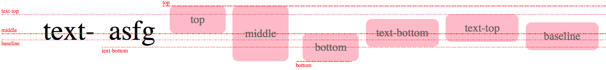

### 文字和排版

源代码 => 语义 => 表现
标签 => 元素 => 盒
Tag => Element => Box

HTML 代码中可以书写开始标签、结束标签、和自封闭标签
一对起止标签，表示一个元素
DOM树中存储的是元素和其它类型的节点（Node）
CSS 选择器选中的是元素
CSS 选择器选中的元素，在排版时间可能产生多个盒
排版和渲染的基本单位是盒

### CSS排版

    CSS三大布局：正常流、弹性布局、grid布局
    CSS的排版里只排两样东西：文字和盒

#### 正常流

  正常流的规则： **依次排列，排不下了换行**

在正常流的基础上，我们有 float 相关规则，使得一些盒占据了正常流需要的规则，我们可以把 float 理解为“文字环绕”。
我们还有 vertical-align 相关规则规定了如何在垂直方向对齐盒。

在CSS标准中，规定了如何排布每一个文字或者盒子算法，这个算法依赖一个排版的“当前状态”，CSS 把这个当前状态称为“格式化上下文”。
我们可以认为排版过程是这样的：

    格式化上下文 + 盒/文字 = 位置
    formatting context + boxes/charater = position

#### margin 折叠(margin collapse)

在同一 正常流 BFC margin 上下会发现折叠

### BFC 合并

BFC(Block Formatting Context)

* Block Container：里面有 BFC 的
  * block/inline-block/table-cell/flex item/grid cell/table-caption
* Block-leave Box：外面有 BFC 的
* Block Box = Block Container + Block-leave Box: 里外都有 BFC的

### flex

felx 排版三步骤

* 收集盒进行
* 计算盒在主轴方向的排布
* 计算盒在交叉轴方向的排布

分行逻辑

* 根据主轴尺寸，把元素分进行
* 若设置no-wrap，则强行分配进第一行

计算主轴方向

* 找出所有 flex 元素
* 把主轴方向的剩余尺寸按比例分配给这些元素
* 若剩余空间为负数，所有 flex 元素为 0 ，等比压缩剩余元素。

计算交叉轴方向

* 根据每一行中最大元素尺寸计算行高
* 根据行高 flex-align 和 item-align，确定元素最终位置
  

### 动画与绘制

CSS 控制表现

* 控制元素的位置和尺寸信息
* 控制绘制和实际看到渲染信息
* 交互动画信息

Animation

* @keyframes定义
* animation

Animation 属性

* animation-name 时间曲线
* animation-duration 动画的时长
* animation-timing-function 动画的时间曲线
* animation-delay 动画开始的延迟
* animation-iteration-count 动画的播放次数
* animation-direction 动画的方向

ps: timing-function 可以在 keyframes 中定义，这样幁以幁之间 timing-function 都会不一样

Transition 属性

* transition-property 要变换的属性
* transition-duration 变换的时长
* transition-timing-function 时间曲线
* transition-delay 延迟

timing-function 用三次贝塞尔曲线表示，根据设计需求可以用cubic-bezier 函数来表示，日常用ease、linear、ease-in、ease-out、ease-in-out，横轴表示的Time，纵轴表示的 Progerssion。

贝塞尔曲线

* 一次贝塞尔曲线由两个点组成，即是日常所见的直线
* 二次贝塞尔曲线由开始点、结束点、控制点组成，随着 t 的时间改变，点之间的线配合t形成的贝塞尔插值，最终从开始点到终点形成的线为贝塞尔曲线。
* 三次贝塞尔曲线由开始点、结束点、两个控制点组成，原理同上。

### 绘制

* 几何图形
  * border
  * box-shadown
  * border-radius
* 文字
  * font
  * text-decoration
* 绘图
  * background-image

### 性能

    **性能优化不能只着眼于局部的代码，一切没有 profiling 的性能都是耍流氓。**

一个健全的性能体系的建立可以分成以下几部分：

* 现状评估和建立指标
* 技术方案
* 执行
* 结果评估和监控

#### 现状评估和建立指标

现状评估和建立指标是性能优化的第一步也是最关键一步，对于指标分为两个方面**性能指标（评估体验）**以及**业务指标（提升业务价值）**

**性能方面**最重要的是以下几点：

* 页面加载性能。
* 动画与操作性能。
* 内存、电量消耗。

#### 技术方案

