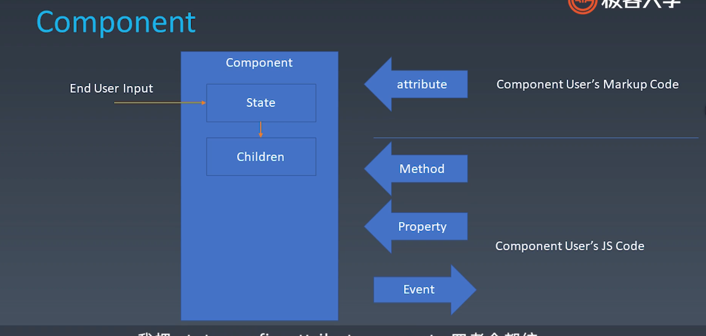

## 组件化
组件化就是从从怎么扩展 HTML 标签，从这方面引申出来的前端架构体，主要目标是复用。
架构模式 就是 MVC、MVVM 它所关心的是前端跟数据逻辑层之间是怎么交互的。

组件化决定了一个前端团队它的一个复用率。

组件的基本概念
组件即是 对象 也是 模块

#### 对象与组件
对象三要素（Properties、Methods、Inherit）
组件组成要素（Properties、Methods、Inherit、Attribute、Config和State、Event、Lifecycle、Children）

#### Attribute vs Property

Attribute 强调描述性 是在XML中描述标签

Property 强调从属关系 是在面向对象中属性
